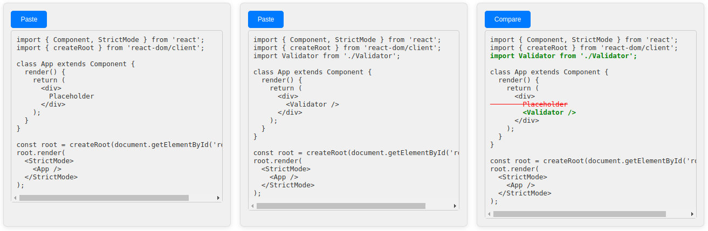
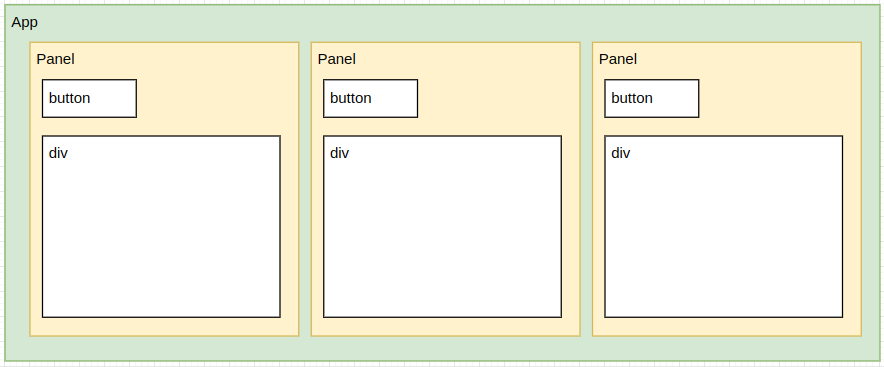
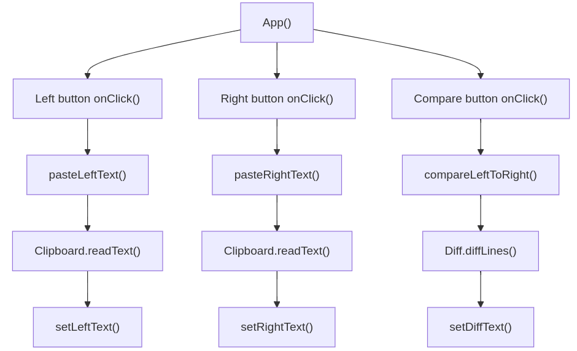
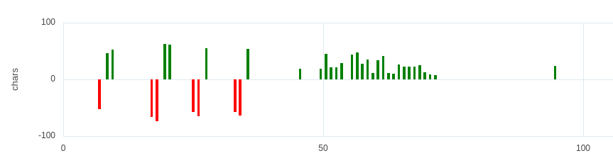

# Differ - A simple text comparision tool 

React single page application (SPA) to compare text buffers in a browser. The application operates in two modes:

- **character comparison**: for single line of text
- **line comparison**: for multi-line text

No need to save text to a file before comparing (as with other desktop tools), just copy and paste the text to the text areas and hit the compare button.

## Model-View-Controller

### View

A custom React component *Panel* is composition of standard HTML *button* and *div* components. The custom component is rended (instantiated) three time to create left, right and compare views.

### Controller

The role of controler (callback functions) in the application is to customize behaviour of the views even they are instances of same *Panel* component.
 

### Model

The application data (content of all three text areas) is kept in React state variables. The state is updated by the controller functions, triggering re-rendering of the views.

## Visualization

The *Chart* component is a simple intance of AG-Charts library bar chart. The chart represents lines/characters added (green) and removed (red).

